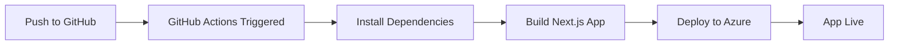

# Azure Deployment with GitHub Actions

## Prerequisites

1. **Azure App Service** created (Linux, Node.js 20 LTS)
2. **Azure SQL Database** set up
3. **GitHub repository** with your code

## Setup Steps

### 1. Get Azure Publish Profile

1. Go to Azure Portal → Your App Service
2. Click **Get publish profile** (download .publishsettings file)
3. Copy the entire contents of this file

### 2. Add GitHub Secret

1. Go to your GitHub repository
2. Settings → Secrets and variables → Actions
3. Click **New repository secret**
4. Name: `AZURE_WEBAPP_PUBLISH_PROFILE`
5. Value: Paste the publish profile content
6. Click **Add secret**

### 3. Update Workflow Configuration

In `.github/workflows/azure-deploy.yml`, update:
```yaml
env:
  AZURE_WEBAPP_NAME: your-actual-app-name    # Replace with your Azure App Service name
```

### 4. Configure Environment Variables in Azure

Go to Azure Portal → App Service → Configuration → Application settings:

#### Database Configuration
- `DB_NAME`: digitalni_registar_procene_rizika
- `DB_USER`: admin123@digitalni-registar-procene-rizika
- `DB_PASSWORD`: [Your secure password]
- `DB_HOST`: digitalni-registar-procene-rizika.database.windows.net
- `DB_PORT`: 1433

#### Application Configuration
- `JWT_SECRET`: [Generate a secure random string - use: node -e "console.log(require('crypto').randomBytes(32).toString('hex'))"]
- `NODE_ENV`: production
- `WEBSITE_NODE_DEFAULT_VERSION`: 20-lts

#### Optional
- `DEBUG`: false
- `ALLOWED_HOSTS`: your-app-name.azurewebsites.net

### 5. Important: Azure App Service Configuration

Make sure your Azure App Service has these settings:
- **Runtime Stack**: Node.js 20 LTS
- **Operating System**: Linux
- **Startup Command**: Leave empty (uses npm start automatically)

### 5. Deploy

1. **Commit and push** your code to the main/master branch
2. **GitHub Actions will automatically**:
   - Install dependencies
   - Build the Next.js app
   - Deploy to Azure App Service
3. **Monitor deployment** in GitHub Actions tab

## Deployment Process



## Post-Deployment Checklist

- [ ] Visit your app URL to verify deployment
- [ ] Check database tables are created automatically
- [ ] Test admin login: admin@admin.com / admin123
- [ ] **Change default admin password immediately**
- [ ] Monitor logs in Azure Portal → Log Stream
- [ ] Set up Application Insights for monitoring

## Troubleshooting

### Common Issues:
1. **Build fails**: Check Node.js version compatibility
2. **Database connection fails**: Verify environment variables in Azure
3. **App doesn't start**: Check logs in Azure Portal → Log Stream

### Useful Commands:
```bash
# Test build locally
npm run build

# Check environment variables
echo $NODE_ENV

# Generate JWT secret
node -e "console.log(require('crypto').randomBytes(32).toString('hex'))"
```

## Security Best Practices

- Use Azure Key Vault for sensitive data
- Enable Application Insights
- Set up custom domain with SSL
- Configure Azure AD authentication if needed
- Regular security updates via Dependabot
## 🚀 *
*Deployment Optimizations**

Your deployment has been optimized to reduce size and improve performance:

### **Size Reduction (193MB → ~50-70MB):**
- **Selective packaging** - Only production files included
- **Production dependencies only** - Dev dependencies excluded  
- **Cleaned node_modules** - Removed test files, docs, and cache
- **Optimized compression** - Smart zip packaging
- **.deployignore** - Excludes unnecessary files

### **Performance Improvements:**
- **Faster deployments** - Smaller package size
- **Reduced cold start** - Less files to load
- **Optimized Next.js build** - Bundle size optimization
- **Production-ready** - Only essential files deployed

### **Active Workflow:**
The deployment uses `.github/workflows/master_digitalni-registar-rizika.yml` which:
- Builds on push to `master` branch
- Uses Node.js 20.x with npm caching
- Creates optimized deployment package
- Deploys to your Azure App Service automatically

### **Monitoring Deployment:**
1. Push changes to `master` branch
2. Go to GitHub → Actions tab
3. Watch the "Build and deploy Node.js app" workflow
4. Check Azure App Service logs for startup confirmation